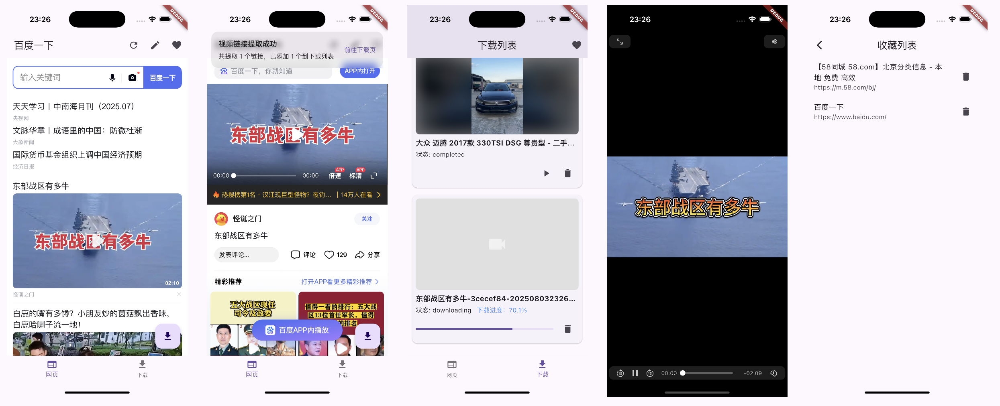

<p align="center">
  <a href="https://www.jianshu.com/u/29f69849848a">
    
  </a>
</p>

<h1 align="center">视界宝</h1>
<div align="center">

一键抓取网页视频，离线畅享高清视界


</div>




# 视界宝 - 您掌中的网页视频捕获专家

视界宝是一款功能强大的Flutter视频下载与播放应用，专注于从网页中智能提取视频链接，并通过FFmpegKit实现高效稳定的本地下载，方便用户离线观看和管理视频文件。

* * *

## 核心功能

-   **网页视频提取**  
    通过集成 `flutter_inappwebview`，支持打开各种视频网页，自动解析并提取视频真实地址，轻松获取多种视频资源。

-   **本地下载与播放**  
    利用强大的 `FFmpegKit` 进行视频下载和转码，保证下载过程高效且兼容多格式；使用 `video_player` 播放器实现流畅本地播放体验。

-   **下载任务管理**  
    通过 `get_storage` 持久化保存下载任务和状态，支持断点续传和应用重启后自动恢复下载，保障下载过程稳定不中断。

-   **文件管理与导出**  
    下载视频可直接访问手机“文件”应用，支持通过iTunes共享导出视频文件到电脑，方便备份与传输。

-   **多页面设计**

    -   视频网页页：浏览和提取视频链接
    -   下载页：管理所有下载任务，查看进度和历史
    -   收藏页：收藏喜爱的视频网页，方便快速访问

* * *

## 项目结构

```
lib/
├── config/          # 配置相关（常量、接口等）
├── controllers/     # 业务逻辑控制器（GetX或其他状态管理）
├── models/          # 数据模型定义
├── pages/           # 页面视图（视频网页、下载列表、收藏列表等）
├── routes/          # 路由管理
├── services/        # 核心服务（视频提取、下载管理等）
├── utils/           # 工具类函数
└── widgets/         # 复用组件
```

* * *

## 主要依赖插件

-   [`flutter_inappwebview`]()  
    用于嵌入强大可扩展的WebView，实现网页视频提取功能。
-   [`FFmpegKit`]()  
    基于FFmpeg的音视频处理库，负责视频下载、格式转换和处理。
-   [`video_player`]()  
    官方Flutter视频播放器插件，支持本地和网络视频播放。
-   [`get_storage`]()  
    高性能轻量级本地存储方案，存储下载任务和状态，实现断点续传及数据持久化。

* * *

## 未来规划

-   支持更多视频格式与更智能的视频解析
-   优化下载速度和稳定性
-   增加更多文件管理和分享功能
-   UI/UX持续优化，提升用户体验

* * *

欢迎使用与反馈！  
如果你喜欢视界宝，请点赞⭐️和分享给更多朋友！