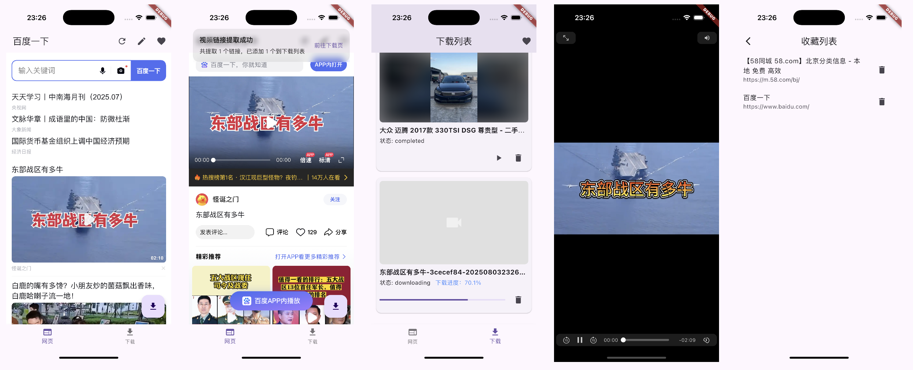

<p align="center">
  <a href="https://www.jianshu.com/u/29f69849848a">
    
  </a>
</p>

<h1 align="center">视界宝</h1>
<div align="center">

一键抓取网页音视频，离线播放、后台聆听、便捷分享

</div>



# 视界宝 - 网页音视频捕获与本地媒体播放工具

视界宝是一款 Flutter 音视频下载与播放应用，支持在内置 WebView 中浏览网页、识别网页中的视频和音频资源、创建下载任务，并在本地完成播放、分享和管理。

## 核心功能

- **网页音视频提取**
  - 支持扫描页面中的 `video`、`audio`、`source` 和资源加载记录。
  - 支持海角详情页接口解析，识别 `attachments` 中的音频和视频。
  - 一个页面中存在多个音频时，会全部识别并分别加入下载任务。
  - 提取流程见 [docs/media_download_flow.md](docs/media_download_flow.md)。

- **音频与视频下载**
  - 视频使用 FFmpegKit 下载/合并到本地 `.mp4`，完成后生成封面。
  - 音频使用带 `Referer / Origin / Cookie / User-Agent` 的直连 HTTP 流式下载，支持 `.mp3/.m4a/.aac/.wav/.ogg/.flac`。
  - 下载任务会持久化保存，重复链接会跳过，避免重复添加。
  - 详情页点击下载后会显示提取中、识别中、添加任务中的实时反馈。

- **本地播放**
  - 支持视频播放和音频播放。
  - 音频播放页提供播放/暂停、进度条、前后 10 秒跳转。
  - 视频和音频均支持后台播放；App 退到后台或锁屏后仍可继续听声音。

- **系统分享**
  - 音频、视频、图片详情页都支持直接分享源文件。
  - Android 使用 `FileProvider` 打开系统分享弹窗。
  - iOS 使用 `UIActivityViewController` 打开系统分享弹窗。
  - 可通过系统分享组件发送到微信、保存到文件，或用其他 App 打开。

- **本地加密媒体入口**
  - 支持把加密后的本地图片、音频、视频放入 `assets/local_media/`。
  - 支持图片、音频、视频三类本地媒体解密后查看/播放/分享。
  - 本地入口默认隐藏，下载 Tab 连续点击 10 次后输入密码解锁。
  - `assets/local_media/` 已加入 `.gitignore`，请自行准备本地资源，不要提交私有媒体文件。

- **收藏与导航**
  - 支持收藏网页地址。
  - 支持侧边栏快速进入收藏页面。
  - 从侧边栏切换到其他网页时，会取消旧页面的提取中状态，避免按钮卡在上一页。

## 本地加密媒体与密码配置

本地加密媒体的访问密码在 [lib/services/local_media_service.dart](lib/services/local_media_service.dart) 中校验：

```dart
static const String unlockPasswordMd5 = '<your-password-md5>';
```

请使用者自行准备一个**原文密码**和它的 **MD5 值**：

- 原文密码只在解锁和解密时输入，不要写入 README 或提交到仓库。
- 代码中只保存原文密码的 MD5 值，用于校验输入是否正确。
- 解密媒体文件时，仍然需要输入原文密码，而不是 MD5。

示例：

- 原文密码：`1234`
- `1234` 的 MD5：`81dc9bdb52d04dc20036dbd8313ed055`
- 项目中配置：

```dart
static const String unlockPasswordMd5 = '81dc9bdb52d04dc20036dbd8313ed055';
```

- 用户解锁和解密时输入：`1234`

可用下面的命令生成 MD5：

```bash
printf '1234' | md5
```

## 本地媒体资源说明

本地加密资源目录：

```text
assets/local_media/
```

应用会读取该目录下的 `index.json` 或 Flutter 资源清单，识别 `.cpp` / `.dat` 后缀的加密文件。解密后会根据原始文件名扩展名判断媒体类型：

- 图片：`.jpg/.jpeg/.png/.webp`
- 音频：`.mp3/.m4a/.aac/.wav/.ogg/.flac`
- 视频：`.mp4`

## 项目结构

```text
lib/
├── config/          # 配置相关
├── controllers/     # GetX 控制器
├── models/          # 下载任务、本地媒体等数据模型
├── pages/           # 网页详情、下载列表、播放页、本地媒体页等
├── routes/          # 路由管理
├── services/        # 下载、提取、分享、本地媒体解密等服务
├── utils/           # 工具类函数
└── widgets/         # 复用组件
```

## 主要依赖

- `flutter_inappwebview`：内置 WebView 和 Cookie 获取。
- `ffmpeg_kit_flutter_new`：视频下载、合并和封面生成。
- `video_player` / `chewie`：音视频播放。
- `get` / `get_storage`：路由、状态管理和本地持久化。
- `crypto` / `pointycastle`：密码 MD5 校验和本地加密媒体解密。

## 验证

常用检查命令：

```bash
dart format lib test
flutter test
flutter analyze
```

当前 Android Gradle 环境如果使用 Java 21，旧版 Gradle 可能会出现 `Unsupported class file major version 65`，需要切换到兼容的 JDK 或升级 Gradle 后再进行 Android 原生编译验证。

## 后续规划

- 增加锁屏媒体控制和通知栏播放控制。
- 优化下载列表中的任务状态展示。
- 扩展更多音视频站点的解析兼容性。
- 优化本地加密媒体的索引生成流程。

欢迎使用与反馈。
