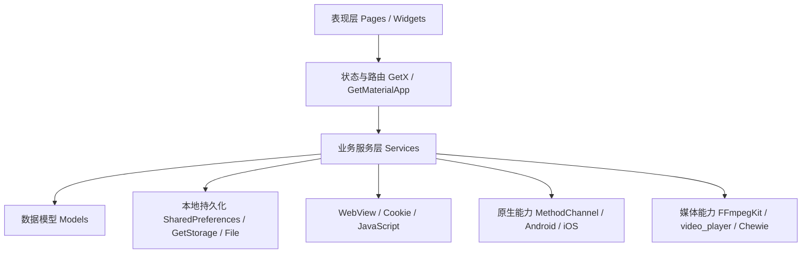
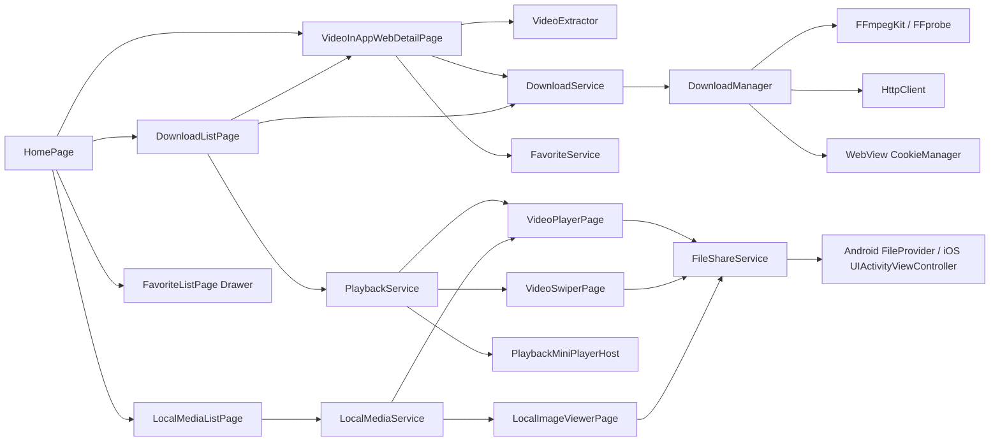
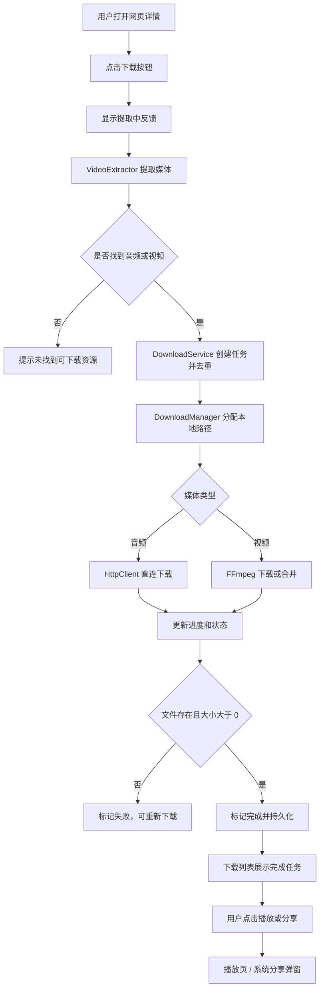

# 视界宝业务说明与架构设计

本文档说明当前 Flutter App 的业务定位、功能模块、核心流程和架构设计。更细的音视频下载链路见 [media_download_flow.md](/Users/huchu/Desktop/player/docs/media_download_flow.md)。

## 1. 产品定位

视界宝是一款面向网页音视频内容管理的移动端工具 App。用户可以在内置 WebView 中访问网页，识别网页内的视频、音频资源，将资源下载到本地，并在 App 内完成离线播放、后台播放、文件分享和收藏管理。

App 当前不依赖自有后端服务，主要能力由 Flutter 客户端、本地持久化、WebView 页面解析、FFmpeg/HTTP 下载、原生分享通道和本地加密媒体解密组成。

## 2. 核心用户场景

1. 用户进入 App 后输入访问密码，解锁主界面。
2. 用户在网页 Tab 中打开目标网页，浏览网页详情。
3. 用户点击下载按钮，App 自动识别当前页面中的音频和视频资源。
4. App 将识别到的媒体创建为下载任务，并在下载列表中展示进度和状态。
5. 用户在下载列表中按视频/音频 Tab 查看任务，下载完成后点击卡片播放。
6. 用户播放视频或音频时，可以返回列表页，播放会话通过 mini player 保持。
7. 用户可以通过系统分享弹窗把本地图片、音频、视频源文件分享给微信、文件 App 或其他应用。
8. 用户可以收藏网页地址，之后从侧边栏或收藏页快速回到该网页。
9. 用户可以通过隐藏入口打开本地加密媒体，输入原文密码后解密播放或查看。

## 3. 功能模块

### 3.1 隐私锁与启动保护

入口文件 [main.dart](/Users/huchu/Desktop/player/lib/main.dart) 在根节点包裹 `AppPrivacyGate`。App 启动后默认展示 `helloworld` 遮盖页，用户点击遮盖页输入密码，通过 `LocalMediaService.isUnlockPassword` 校验后才能操作主界面。

隐私保护能力包括：

- Flutter 层 `AppPrivacyGate` 在 App 进入 inactive、hidden、paused 状态时重新上锁。
- Android 原生层设置 `FLAG_SECURE`，降低截图和录屏泄露风险。
- iOS 原生层在退到后台时显示独立 `privacyWindow`，遮盖系统后台快照。

### 3.2 首页导航与 WebView 浏览

首页 [home_page.dart](/Users/huchu/Desktop/player/lib/pages/home_page.dart) 使用 `IndexedStack` 保持页面状态，主要入口包括：

- 网页 Tab：内置 WebView 页面。
- 下载 Tab：下载任务列表。
- 本地 Tab：隐藏入口，解锁后才显示。

网页页面 [video_inapp_web_detail_page.dart](/Users/huchu/Desktop/player/lib/pages/video_inapp_web_detail_page.dart) 提供：

- 默认首页加载和自定义 URL 输入。
- WebView 前进、后退、刷新。
- 当前网页标题读取。
- 收藏/取消收藏。
- 打开侧边栏收藏列表。
- 当前页面音视频链接提取。
- 提取状态反馈和 SnackBar 操作提示。

### 3.3 收藏管理

收藏模块由 [FavoriteService](/Users/huchu/Desktop/player/lib/services/favorite_service.dart) 和 [FavoriteListPage](/Users/huchu/Desktop/player/lib/pages/favorite_list_page.dart) 组成。

业务能力：

- 收藏当前网页 URL 和页面标题。
- URL 归一化，避免缺少 `https://` 导致无法打开。
- 通过 `SharedPreferences` 持久化收藏列表。
- 收藏列表显示网页标题、网页域名、网页全路径。
- 侧边栏模式支持点击收藏后直接切换首页 WebView。
- 独立收藏页支持删除、长按取消收藏。
- 通过事件总线通知收藏状态变化。

### 3.4 媒体链接提取

媒体提取由 [VideoExtractor](/Users/huchu/Desktop/player/lib/utils/video_extractor.dart) 承担，网页详情页负责触发和展示提取反馈。

提取策略：

- 对目标站点详情页 `/post/details?pid=...` 使用接口优先策略。
- 通过 WebView Cookie、Referer、User-Agent 请求详情接口和附件线路接口。
- 支持接口返回的加密 data 解码。
- 从附件中识别 `audio` 和 `video`，保留附件 id，方便后续重新下载时刷新真实地址。
- 如果接口提取成功，只使用接口结果，避免 DOM 结果混入导致重复任务。
- 对非目标站点页面或接口结果为空的页面，回退扫描 DOM、`video`、`audio`、`source`、链接和 performance 资源记录。
- 最终按媒体类型和 URL 去重。

### 3.5 下载任务管理

下载模块分为状态服务和底层下载器：

- [DownloadService](/Users/huchu/Desktop/player/lib/services/download_service.dart)：任务创建、去重、持久化、状态流转、重试、强制重试、异常 watchdog。
- [DownloadManager](/Users/huchu/Desktop/player/lib/services/download_manager.dart)：文件路径生成、HTTP 直连下载、FFmpeg 下载/合并、封面生成、下载取消。

业务能力：

- 支持视频和音频两类任务。
- 下载列表按视频/音频拆分 Tab。
- 下载卡片展示文件名、来源域名、状态、进度和操作按钮。
- 视频任务下载完成后生成封面。
- 音频任务使用较小卡片布局。
- 任务保存 `originPageUrl` 和 `sourceAttachmentId`，重试目标站点任务时可重新解析最新真实下载地址。
- 任务去重使用 `mediaType + normalizedUrl`，避免同一个页面添加重复下载。
- 下载会话按 `task.id` 管理，避免删除重复任务时误取消其他任务。
- 下载中长时间无文件增长或进度不更新时，watchdog 会标记失败。
- 下载中可强制重新下载，解决卡在下载中、100% 不完成等异常交互问题。
- App 启动恢复任务时会校验本地文件是否存在，避免“显示完成但文件不存在”。

### 3.6 本地文件存储

下载文件存储在 Flutter 应用文档目录：

```text
getApplicationDocumentsDirectory()
```

任务持久化在 `GetStorage` 的 `download_tasks` 中，主要字段包括：

- `id`
- `url`
- `originPageUrl`
- `sourceAttachmentId`
- `fileName`
- `mediaType`
- `progress`
- `status`
- `thumbnailPath`
- `filePath`

文件命名会追加任务 id 短后缀，避免同名覆盖。App 启动后会修复文档目录变化导致的历史路径问题。

### 3.7 播放与后台播放

播放模块由 [PlaybackService](/Users/huchu/Desktop/player/lib/services/playback_service.dart)、[VideoPlayerPage](/Users/huchu/Desktop/player/lib/pages/video_player_page.dart)、[VideoSwiperPage](/Users/huchu/Desktop/player/lib/pages/video_swiper_page.dart) 和 [PlaybackMiniPlayerHost](/Users/huchu/Desktop/player/lib/widgets/playback_mini_player.dart) 组成。

业务能力：

- 视频使用 `video_player + chewie` 播放。
- 音频复用 `video_player` 文件控制器播放，并提供音频专用 UI。
- 音频播放支持播放/暂停、进度条、前后 10 秒跳转。
- 视频播放页支持分享、全屏、倍速等 Chewie 控制能力。
- 下载列表点击视频进入竖滑播放页，可以上下切换视频。
- 离开播放页后，当前播放控制器可交还给全局 `PlaybackService`，底部显示 mini player。
- mini player 支持回到播放详情、暂停/播放、停止。
- iOS 配置 `UIBackgroundModes = audio`，并设置 `AVAudioSession.playback`。
- `VideoPlayerOptions.allowBackgroundPlayback = true`，支持视频退后台继续听声音，音频退后台和锁屏继续播放。

### 3.8 系统分享

分享模块由 [FileShareService](/Users/huchu/Desktop/player/lib/services/file_share_service.dart) 和原生平台实现组成。

支持分享的文件类型：

- 下载完成的视频。
- 下载完成的音频。
- 本地解密后的图片。
- 本地解密后的音频和视频。

平台实现：

- Android：通过 `MethodChannel("player/file_share")` 调用 `ACTION_SEND`，使用 `FileProvider` 暴露只读文件 URI。
- iOS：通过 `MethodChannel("player/file_share")` 打开 `UIActivityViewController`。

用户可通过系统分享面板发送到微信、保存到文件或用其他 App 打开。

### 3.9 本地加密媒体

本地媒体模块由 [LocalMediaService](/Users/huchu/Desktop/player/lib/services/local_media_service.dart)、[LocalMediaListPage](/Users/huchu/Desktop/player/lib/pages/local_media_list_page.dart) 和 [LocalImageViewerPage](/Users/huchu/Desktop/player/lib/pages/local_image_viewer_page.dart) 组成。

业务能力：

- 本地入口默认隐藏，用户连续点击下载 Tab 10 次后输入密码显示。
- 支持读取 `assets/local_media/index.json` 或 Flutter 资源清单。
- 支持 `.cpp` / `.dat` 加密后缀。
- 支持图片、音频、视频三类资源。
- 原文密码只在解锁和解密时输入，代码中保存密码 MD5 用于校验。
- 解密后输出到临时目录，图片进入图片查看器，音频/视频进入播放页。
- 图片查看器支持缩放、还原、分享。

项目提供配套脚本：

- [encrypt_local_media.sh](/Users/huchu/Desktop/player/scripts/encrypt_local_media.sh)：把明文媒体加密到 `assets/local_media/` 并生成 `index.json`。
- [decrypt_local_media.sh](/Users/huchu/Desktop/player/scripts/decrypt_local_media.sh)：在电脑端解密 `.cpp/.dat` 文件用于查看。

### 3.10 配置与持久化

[AppConfig](/Users/huchu/Desktop/player/lib/config/app_config.dart) 负责：

- 默认网页地址。
- URL 归一化。
- 自定义首页 URL 持久化。
- 首页 URL 重置。

当前持久化介质：

- `SharedPreferences`：收藏列表、自定义首页。
- `GetStorage`：下载任务。
- 应用文档目录：下载后的音频、视频、视频封面。
- 临时目录：解密后的本地媒体临时文件。
- Flutter assets：加密媒体包。

## 4. App 架构设计

### 4.1 分层结构



分层说明：

- 表现层：负责页面展示、用户交互、SnackBar 反馈、列表和播放器 UI。
- 状态与路由层：通过 GetX 注入服务、维护响应式状态、管理页面跳转。
- 业务服务层：承载下载、播放、收藏、分享、本地媒体解密等核心业务。
- 数据模型层：定义下载任务、收藏、本地媒体实体。
- 持久化层：保存任务、收藏、配置和本地文件。
- Web 能力层：负责 WebView 页面访问、Cookie 读取、JS 扫描和站点接口解析。
- 原生能力层：负责系统分享、隐私保护窗口、后台音频会话。
- 媒体能力层：负责下载合并、封面、音视频播放。

### 4.2 模块依赖关系



### 4.3 主业务流程



更详细的接口提取、下载、重试、文件校验和重复任务处理见 [media_download_flow.md](/Users/huchu/Desktop/player/docs/media_download_flow.md)。

### 4.4 状态管理与路由

App 使用 GetX 管理全局服务和路由：

- `FavoriteService`：启动时同步注册，异步初始化收藏列表。
- `DownloadService`：全局注入，加载历史任务，恢复任务状态，补生成视频封面。
- `PlaybackService`：永久注入，维护全局播放会话和 mini player 状态。
- `HomePageController`：维护当前底部 Tab、WebView 是否可返回、双击网页 Tab 回首页事件。

路由由 [RouteHelper](/Users/huchu/Desktop/player/lib/routes/route_helper.dart) 统一管理：

- `/`：首页。
- `/downloadList`：下载列表。
- `/videoWebDetail`：网页详情。
- `/player`：音频/视频播放详情。
- `/favorite`：收藏列表。
- `/video-swiper`：视频竖滑播放。
- `/local-image-viewer`：本地图片查看。

### 4.5 下载异常处理设计

下载异常处理围绕“避免假完成、避免重复任务、允许人工恢复”设计：

- 添加任务前检查 URL 是否为 `http/https`，拒绝 `blob:` 等页面临时地址。
- 创建任务期间用 `_creatingTaskKeys` 防止异步重复添加。
- 下载任务按 `task.id` 管理 FFmpeg session 和 HTTP client。
- 视频下载使用 FFmpeg `rw_timeout`，音频下载使用 HttpClient 超时。
- watchdog 每 15 秒检查文件是否增长，超过 2 分钟无活动则标记失败。
- 进度达到 100% 后必须校验本地文件存在且大小大于 0。
- 下载中可以强制重新下载，先取消旧会话，再刷新地址、删除旧文件、重新启动任务。

### 4.6 播放会话设计

播放会话通过全局 `PlaybackService` 解决页面销毁和播放状态延续问题：

- 播放详情页进入时调用 `PlaybackService.open` 初始化会话。
- 如果点击的是正在播放的同一个文件，复用当前会话。
- 页面退出时调用 `detachPage`，全局状态显示 mini player。
- 竖滑视频页退出时可把当前 `VideoPlayerController` 交回 `PlaybackService`，避免重新初始化造成转圈。
- 点击 mini player 时，通过 `openFullPlayer` 回到播放详情页并复用会话。
- 停止播放时释放控制器、清空全局状态、隐藏 mini player。

### 4.7 原生平台设计

Android 原生层：

- `MainActivity` 设置 `FLAG_SECURE`。
- 注册 `player/file_share` MethodChannel。
- 使用 `FileProvider` 暴露文件 URI。
- 根据文件扩展名推断 MIME 类型。

iOS 原生层：

- 配置 `AVAudioSession` 为 playback。
- `Info.plist` 开启 `UIBackgroundModes: audio`。
- 注册 `player/file_share` MethodChannel。
- 使用 `UIActivityViewController` 分享本地文件。
- 后台切换时显示隐私遮罩窗口。

## 5. 技术栈

主要 Flutter 依赖：

- `flutter_inappwebview`：内置浏览器、Cookie 读取、JS 执行。
- `get`：路由、依赖注入、响应式状态。
- `get_storage`：下载任务本地持久化。
- `shared_preferences`：收藏列表和配置持久化。
- `ffmpeg_kit_flutter_new`：视频下载、合并、封面生成、媒体信息读取。
- `video_player`：本地音视频播放。
- `chewie`：视频播放 UI。
- `path_provider` / `path`：文件路径管理。
- `crypto` / `pointycastle`：密码校验、本地加密媒体解密。
- `flutter_staggered_grid_view`：下载列表瀑布流卡片。

## 6. 测试与验证现状

当前已有测试覆盖：

- [video_extractor_test.dart](/Users/huchu/Desktop/player/test/video_extractor_test.dart)：媒体提取逻辑。
- [download_task_test.dart](/Users/huchu/Desktop/player/test/download_task_test.dart)：下载任务模型。
- [app_config_test.dart](/Users/huchu/Desktop/player/test/app_config_test.dart)：URL 归一化和配置。
- [widget_test.dart](/Users/huchu/Desktop/player/test/widget_test.dart)：基础 Flutter widget 测试。

建议常用验证命令：

```bash
dart format lib test
flutter test
flutter analyze
```

## 7. 当前边界与后续方向

当前边界：

- App 没有自有后端，依赖目标网页、目标站点接口和 WebView Cookie。
- 目标站点接口规则属于站点特化解析，站点接口变化时需要维护提取逻辑。
- `blob:` 这类页面内临时地址不支持直接下载，必须解析到真实 `http/https` 地址。
- 后台播放更多依赖平台能力和 `video_player` 支持，锁屏媒体控制和通知栏控制尚未完整实现。

后续可扩展方向：

- 增加更多站点的接口解析适配。
- 增加锁屏媒体控制、通知栏播放控制。
- 增加下载任务批量管理和任务详情页。
- 增加下载队列限流，控制并发数。
- 增强本地媒体库管理，例如分组、搜索、排序。
- 增加分享前文件存在性和大小展示。
