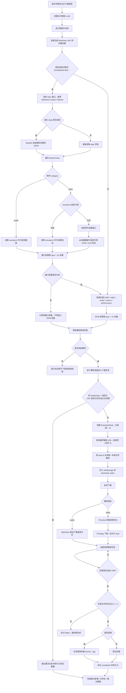

# 媒体下载流程

本文档说明网页详情页中音频、视频从“提取下载链接”到“加入下载任务、下载、本地存储、打开播放”的完整链路。

## 总流程图



## 下载地址提取

网页详情页点击下载按钮后，页面会先记录一次提取 `runId`，用于区分当前页面的提取任务。用户在“正在提取中”时切换页面或重新打开侧边栏，旧页面的提取结果不会继续污染新页面按钮状态。

海角详情页使用接口优先策略：

- 页面 URL 符合 `/post/details?pid=...` 时，优先请求详情接口。
- 请求时带上 WebView 当前登录态 Cookie，以及必要的 `Referer` / `Origin`。
- 接口返回加密 `data` 时，先解码再解析 JSON。
- 音频通常来自 `attachments[].remoteUrl`。
- 视频优先使用 `attachments[].remoteUrl`；为空时，再请求附件线路接口获取可用的 `m3u8` 或 `mp4`。

如果海角接口已经提取到媒体，下载流程只使用接口结果，不再额外混入 DOM / performance 扫描结果。这样可以避免同一个真实媒体地址被页面资源记录和接口附件同时命中，导致一个下载按钮添加两个任务。

非海角页面或接口为空时，回退扫描页面：

- `video`
- `audio`
- `source`
- 直接指向媒体扩展名的链接
- `performance.getEntriesByType("resource")` 中的媒体资源

最终所有候选会按 `type + url` 去重。

## 下载任务创建

下载任务由 `DownloadService.addDownloadTask` 创建。创建前会生成任务 key：

```text
mediaType + normalizedUrl
```

其中 URL 会先 `trim`，移除 fragment，并做 path 规范化。这样可以拦截以下重复情况：

- 同一个音频或视频被重复点击下载。
- 提取器短时间内重复回调。
- 同一页面接口结果和扫描结果指向同一个媒体。
- 已存在任务仍在下载列表中。

任务创建期间还会放入一个“正在创建”的集合，避免异步路径生成和持久化之间的并发重复创建。

每个 `DownloadTask` 都有持久化的唯一 `id`。这个 `id` 用于：

- 管理 FFmpeg 下载会话。
- 管理音频 HTTP 下载客户端。
- 生成唯一文件名后缀。
- 避免删除一个重复任务时误取消另一个任务。

## 本地文件路径

下载目录来自 Flutter 的应用文档目录：

```text
getApplicationDocumentsDirectory()
```

文件名规则：

- 优先使用页面标题或附件名称。
- 音频保留可识别扩展名：`.mp3/.m4a/.aac/.wav/.ogg/.flac`。
- 无法识别的音频默认保存为 `.mp3`。
- 视频统一输出为 `.mp4`。
- 文件名会追加 `task.id` 的短后缀，避免同名覆盖。

示例：

```text
example_audio_ab12cd34.mp3
example_video_ef56gh78.mp4
thumb_example_video_ef56gh78.jpg
```

任务本身持久化在 GetStorage：

```text
download_tasks
```

持久化字段包括：

- `id`
- `url`
- `originPageUrl`
- `sourceAttachmentId`
- `fileName`
- `mediaType`
- `progress`
- `status`
- `thumbnailPath`
- `filePath`

App 启动恢复任务时，会修正应用文档目录路径。如果历史任务标记为 completed，但本地文件不存在或大小为 0，会改为 failed，避免下载列表显示完成但点击打不开。

## 音频下载

音频使用 `HttpClient` 直连下载。

请求头会带上：

- `User-Agent`
- `Referer`
- `Origin`
- `Cookie`

下载过程：

1. 创建本地输出文件。
2. 按响应流写入文件。
3. 如果响应有 `contentLength`，按已接收字节数计算进度。
4. 流结束后 flush / close 文件。
5. 回调 `progress = 1.0`。
6. 下载服务检查文件是否存在且大小大于 0。
7. 校验通过后标记为 completed。

音频不生成封面。

## 视频下载

视频使用 FFmpegKit。

下载过程：

1. 先用 FFprobe 获取媒体时长。
2. 使用 FFmpeg 参数下载或合并媒体：

```text
-user_agent ...
-headers ...
-protocol_whitelist file,http,https,tcp,tls,crypto
-allowed_extensions ALL
-i <url>
-c copy
<local-file-path>
```

3. 根据 FFmpeg statistics 中的 time 和视频总时长计算进度。
4. FFmpeg 成功后回调 `progress = 1.0`。
5. 下载服务检查本地文件是否存在且大小大于 0。
6. 校验通过后标记 completed。
7. 生成 `thumb_*.jpg` 封面。
8. 保存任务状态。

## 删除、取消与重试

取消或删除任务时，会先按 `task.id` 找到对应的下载会话：

- 视频：取消对应 FFmpeg session。
- 音频：关闭对应 HttpClient。

确认取消后，再删除这个任务自己的：

- `filePath`
- `thumbnailPath`

最后再从任务列表移除并持久化。

这个顺序可以避免一个任务还在写文件时，另一个同 URL 任务先删除同名文件，造成“进度 100%，但文件不存在”。

重试任务时，会先重置进度和状态，再判断是否需要刷新下载地址：

- 普通网页任务没有接口附件 id，直接复用任务保存的 `url` 重新下载。
- 海角详情页任务会在首次提取时保存 `sourceAttachmentId`。
- 如果任务有 `sourceAttachmentId` 和 `originPageUrl`，重试前会重新请求海角详情接口和附件线路接口，按附件 id 刷新最新的音频/视频直链。
- 刷新成功后，会把 `task.url` 更新为最新媒体地址，再删除旧文件并重新启动下载。
- 刷新失败时，保留原有 `task.url` 继续重试，避免老任务或临时接口不可用时完全无法操作。

这个逻辑适配海角网“下载地址不是页面标签，而是从接口解析得到”的情况。下载列表页和视频滑动页的“重新下载”按钮都调用同一个 `DownloadService.retryDownload`，因此都会走这套刷新逻辑。

## 重复任务问题的修复点

之前的问题组合是：

- 提取阶段可能同时收集接口结果和页面资源结果，同一个媒体被识别两次。
- 下载中的 FFmpeg session / HttpClient 按 URL 保存，重复任务共享同一个取消键。
- 删除重复任务时，可能取消了另一个正在下载的任务。
- 本地文件名可能相同，删除一个任务时也可能删除另一个任务正在使用的文件。
- 下载完成状态只信任进度，没有再次校验文件是否真实存在。

当前防护逻辑：

- 海角详情页接口有结果时，不再混入 DOM / performance 结果。
- 添加任务前按 `mediaType + normalizedUrl` 去重。
- 异步创建任务期间使用 `_creatingTaskKeys` 防并发重复。
- 下载会话按 `task.id` 管理，不再按 URL 管理。
- 本地文件名追加 `task.id` 短后缀，避免文件路径碰撞。
- 100% 后必须检查文件存在且大小大于 0，才允许标记 completed。
- App 启动恢复时会重新校验 completed 任务的本地文件。
