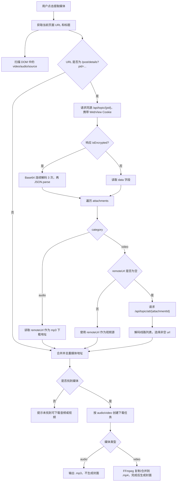

# Media Download Flow

Notes:

- Audio normally comes from `attachments[].remoteUrl` and is a direct file URL.
- Video may come from `attachments[].remoteUrl`, or from `/api/topic/att/{id}` when the topic detail only has an empty `remoteUrl`.
- If every video line returns an empty `url`, the app cannot download it because the site did not provide a playable source for the current login state.
